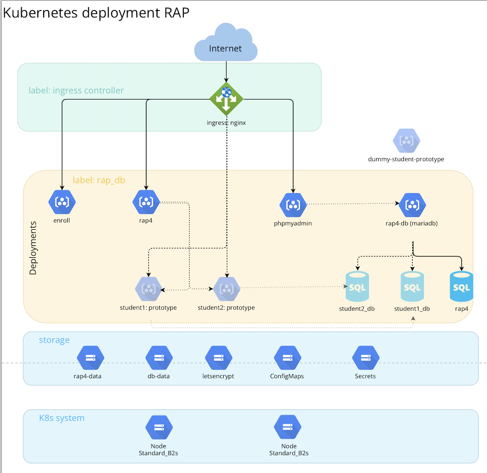
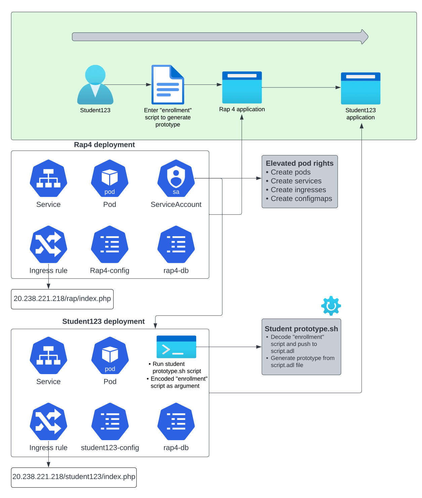
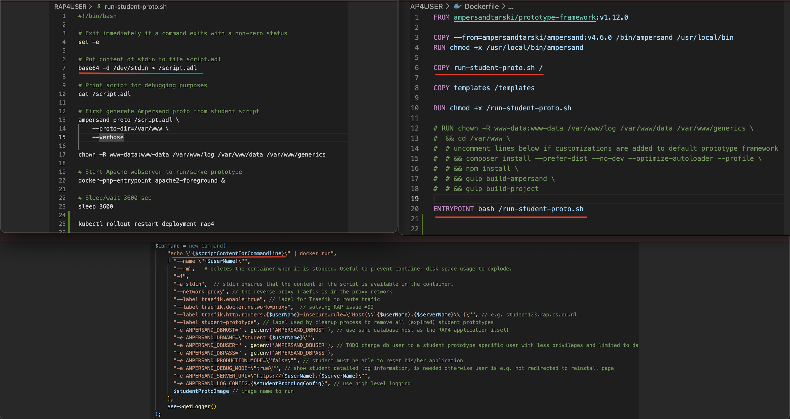

# Architecture Overview

The Kubernetes deployment chart consists of several components that work together to provide a robust and scalable platform for running the rap application. The architecture includes the following:

-Ingress Nginx Controller
-Deployments(Enroll,Rap4,PhpMyAdmin,Rap4-DB)
-Storage

These components are all deployed on a single node within the Kubernetes cluster.

## Ingress Nginx Controller
The Ingress Nginx Controller is a Kubernetes resource that acts as a reverse proxy and load balancer for HTTP and HTTPS traffic. It receives incoming traffic and routes it to the appropriate service or pod within the Kubernetes cluster based on the configured rules.

## Deployments
### Enroll Pod
The Enroll Pod is a containerized application that is used as an example in this context. It is a generated information system from the rap application. The purpose of the system is to enroll students for modules. 

### Rap4 Pod
The Rap4 Pod is a containerized application that is used to generated information systems. The tool stores ampersand-script in which the user can specify,analyze and building information systems. 

### PhpMyAdmin Pod
The PhpMyAdmin Pod is a containerized application that provides a graphical user interface for managing the MariaDB MySQL database that is used the rap application. This pod contains the necessary software, libraries, and configuration files to run the PhpMyAdmin service for your application.

### Rap4-DB Pod
The Rap4-DB Pod is a containerized MariaDB MySQL database instance that is used by your application. This pod contains the necessary software, libraries, and configuration files to run the MariaDB service for the rap application. The Enroll Pod and Rap4 Pod both use a ConfigMap to connect to the Rap4-DB Pod.

### Prototype
A user of the Rap4 application can generate a prototype using a script. This prototype is called student1:prototype and it gets added to the MariaDB MySQL database hosted by the Rap4-DB Pod.

## Storage
The use of a MariaDB MySQL database allows for the efficient storage and retrieval of data. Configmaps are used to store the configuration data. The MariaDB hosts all the data of the rap application 

# Deep dive RAP

This chapter is meant as a deep dive and is divided into two sections. The first section will provide an explanation of the workflow and deployments. The second section will demonstrate how the design choices, from Docker to Kubernetes, were put into practice.

## Workflow and deployments overview

### Workflow
The following overview outlines the workflow for creating a prototype as a student. The student will first log into the Rap 4 website, create a script, compile it, and then generate the prototype based on the script. 

### Rap 4 deployment

The deployment of Rap 4 involves several manifest files, including deployment, ingress rule, service, service account, and configmaps files. The service account is a critical component for generating the student prototype application since it contains RBAC (Role Based Access Control) permissions that enable it to deploy resources to a Kubernetes cluster. Service accounts are used to connect to the Kubernetes API Server. In this case, the Rap 4 service account has been granted rights to create pods, services, ingresses, and configmaps. By granting these rights, the student prototype can be configured similarly to the Rap 4 deployment.

The deployment file pulls the image "ampersandtarski/ampersand-rap:2021-10-22" from the ampersandtarski repository and uses configmaps as environment variables. The Rap 4 pod connects to the database through the configmaps, specifically, db_config(rap4-db) and rap4-config. The db_config contains the root password for the MYSQL database, the MYSQL user, and password. The mysql rap4-db is accessed with these values. The Rap4-config contains ampersand configuration data such as the server URL, Ampersand user, log configuration, etc.

The service and ingress rule are used to reach the Rap 4 application from an external entry point. The ClusterIP service exposes the pod to a web server, and the ingress routes incoming requests to the web-server service based on the path. In this case, the path is `20.238.221.218/rap/index.php`.

### Student123 deployment 

The deployment of student123 involves several manifest files, including deployment, ingress rule, service, and configmaps. 

The deployment manifest file pulls the image "ampersandtarski/rap4-student-prototype:v1.1.1" from the ampersandtarski repository. The "enrollment" script that is referred to in the workflow is added as a base64-encoded argument in the manifest file. Once the pod starts, it first runs the run-student-proto bash script. This script decodes the base64-encoded text and writes the content to a script.adl file. This script.adl file generates the prototype with the Ampersand compiler.

The db_config configmaps of the rap4 and student123 deployment are the same because the pod is connecting to the same MYSQL database. The Ampersand data in the rap4-config differs and depends on the pod.

The service and ingress rule are used to reach the student123 application from an external entry point. The ClusterIP service exposes the pod to a web server, and the ingress routes incoming requests to the web-server service based on the path. In this case, the path is `20.238.221.218/student123/index.php`.

## Docker to Kubernetes

This section will demonstrate the implementation of design choices from Docker to Kubernetes.

In the Docker setup, the student prototype application was started from the RAP application by using the Docker daemon on the host machine, from the RAP 4 container. This was accomplished by mounting the volume /var/run/docker.sock:/var/run/docker.sock to the RAP 4 deployment in the Docker Compose file.

A similar approach in Kubernetes involves using the Kubernetes API to create a resource, for which a service account is used. This is explained in the RAP 4 deployment chapter. Once the RAP 4 pod has been granted rights to create a new pod, **Kubectl** needs to be installed to apply the manifest files of the new resource. Kubectl will need to be added to the RAP 4 Dockerfile

In order to make this whole deployment work in the kubernetes architecture the following changes have to been made to the ampersand rap docker file. 
- Add kubectl 
- Copy "student" prototype yaml file to rap 4 pod

<pre><code>
RUN apt update && \
    apt install -y curl && \
    curl -LO https://storage.googleapis.com/kubernetes-release/release/`curl -s https://storage.googleapis.com/kubernetes-release/release/stable.txt`/bin/linux/amd64/kubectl && \
    chmod +x ./kubectl && \
    mv ./kubectl /usr/local/bin/kubectl
</code></pre>

### Student123 prototype scripting files

The student prototype container is started by calling the Docker run command in the code. The content of the `scriptContentForCommandline` variable, which refers to the "enrollment" script in the workflow, is base64 encoded and written to the Docker stdin. When the container starts, it runs the **run-student-pro.sh** script, which places the stdin content into the script.adl file on line 7. The .adl file is then used to generate the Ampersand prototype. 

In Kubernetes, the student prototype container starts when the student123 manifest file is applied. The **running-student-prototype2.sh** script is used in Kubernetes, which is adjusted for Kubernetes and refers to the new script. The command field, which specifies the entry point of the pod, is set to `["bash", "/run-student-prototype2.sh"]`, while the args field refers to the "enrollment" script in the workflow, which is also base64 encoded. The argument of the Kubernetes file is placed into the script.adl file on line 7 of the script, which is then used to generate the Ampersand prototype.

