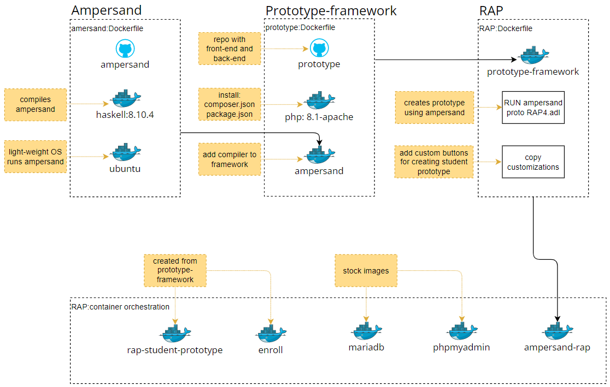
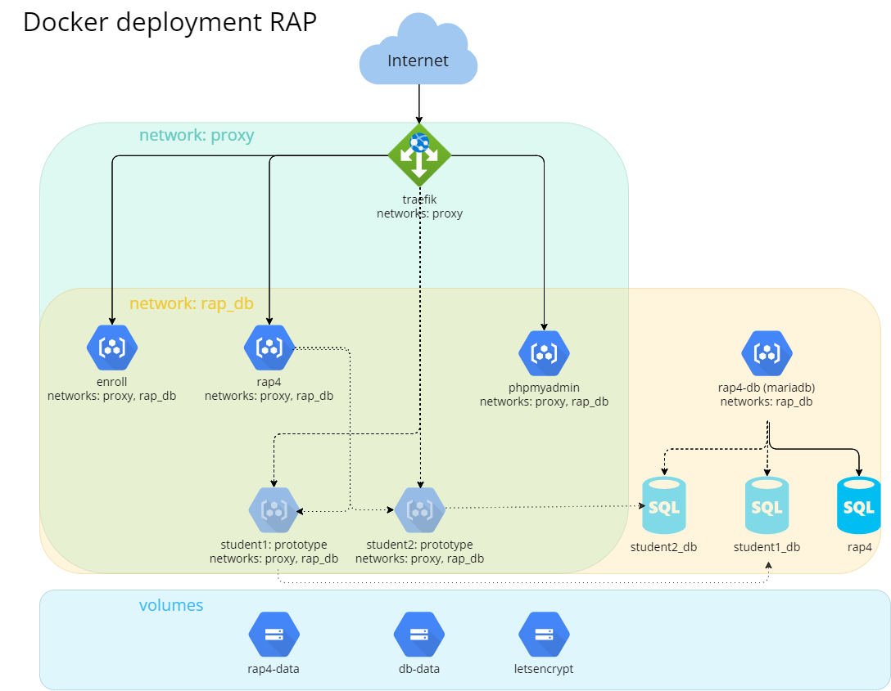

# Deployment
(Explain 2 different types of deployment)

## RAP Docker image
To understand the contents of the RAP docker imager, it is important to discuss two other images first; Ampersand and Prototype-framework.

**Ampersand** ([repository](https://github.com/AmpersandTarski/Ampersand))
The application that checks and compiles ADL-scripts (business rules in Ampersand language). It returns a set of files (json and sql) containing the information system; backend, API and frontend and database queries.

The Ampersand application is compiled with Haskell, a light-weight Linux OS is included in the Docker image to run the Ampersand application.

**Prototype-Framework** ([repository](https://github.com/AmpersandTarski/prototype))
The php framework that transforms output files from the Ampersand application into a web application. The Ampersand application is included in the image, see the lines from the prototype Dockerfile below.

```
COPY --from=ampersandtarski/ampersand:v4.7 /bin/ampersand /usr/local/bin
RUN chmod +x /usr/local/bin/ampersand
```

Because Ampersand is included, the prototype framework can directly generate a new information system from an ADL-script. A database is still required.

**RAP** ([repository](https://github.com/AmpersandTarski/RAP))
The RAP application is created from the prototype-framework image, using the ADL-script with all business relation required. For example:

- Create user and login
- Show account and change password
- Add a new ADL-script (through a file upload or text field)
- List scripts

Custom code is bootstrapped to the framework, this code includes functionality not generated by Ampersand:

- Compile the users ADL-script
- Create a functional specifiction document
- Deploy a generated information system from the ADL-script
  - Docker-compose
  - Kubernetes Cluster

## Container orchestration


<sup>*Figure 1: Rap Workflow*</sup>

As shown in the figure above, the RAP application is deployed together with 4 other application, either using Docker-compose or Kubernetes.

**rap-student-prototype**
A very minimal application generated by Ampersand that has an entry point for ADL-scripts. When this container is spun up, an ADL-script is injected to create a new information system.

**enroll**
A demo application generated by Ampersand.

**mariadb en phpmyadmin**
Mariadb is the database used by RAP, enroll and student prototypes. Phpmyadmin to view the database contents.


# Docker

(Explain docker)

### Architecture

The Docker-compose deployment chart consists of several components that work together to provide a robust and scalable platform for running the RAP application. The architecture includes the following:

- Traefik reverse proxy
- Networks
- Applications (Enroll, RAP, PhpMyAdmin, MariaDB)
- Persistant Storages

The figure below shows how the container orchestration is configured in docker compose.


<sup>*Figure 2: Docker Architecture*</sup>
### Components

**Reverse-proxy**

Traefik, in combination with let's encrypt, is used as reverse proxy to route external traffic to the different containers.

**Networks**

Two virtual networks are created.

The proxy network contains the traefik reverse proxy, that handles external traffic to containers in the virtual network. All containers except the database are running inside the proxy network.

The rap_db network cannot be accessed from an external source. All containers are included in this network and can therefor make SQL queries.

**Volumes**

The mariadb database and let's encrypt have persistant volumes for data storage.

**Applications**

RAP, enroll, mariadb and phpmyadmin are running continually. From the RAP application student prototypes are spun up, that run temporarily.

**Student-prototype**

A student prototype is an information system generated with the RAP application. The student ADL-script is checked with Ampersand compiler and encoded as base64.

The RAP application has Docker-cli installed and runs a new container with the following command:

```
echo <<base64 encoded ADL-script>> | docker run --name <<student-name>> ampersandtarski/rap4-student-prototype:v1.1.1
```

The student-prototype container runs for 1 hour and is ended automatically.

Multiple student prototypes can run in parallel.


### Deployment

**Prerequisites**
 - Make sure you have [docker](https://docs.docker.com/get-docker/) installed.
 - Make sure you have [git](https://git-scm.com/downloads) installed.

If you are on Windows, you need to install WSL2 in order to take full advantage of the functionality of RAP4. Here are the [installation instructions for WSL2](https://docs.microsoft.com/en-us/windows/wsl/install-win10). There is also a [nice youtube item on how to configure WSL2 and a quick overview of it](https://www.youtube.com/watch?v=j0PPcUUtHlw).

**Installation**
Follow these steps to get up and running:

1. On a command line, paste the following commands:

   ~~~.bash
   git clone https://github.com/AmpersandTarski/RAP.git RAP
   cd RAP
   git checkout development
   ~~~

   This will clone the software and make it available on your machine. 

2. Copy the file `.example.env` to `.env` . It contains environment variables that are required by RAP. :

   ~~~.bash
   cp .example.env .env
   ~~~ 
   
   Edit the values in the .env file as follows (or leave them if you're in a rush)
   ```
    * MYSQL_ROOT_PASSWORD=<invent a secure password for the DB root>
    * MYSQL_AMPERSAND_PASSWORD=<invent a secure password for the user 'ampersand'>
    * SERVER_HOST_NAME=<the full domain name of the host, e.g. 'localhost' or 'rap.cs.ou.nl'> 
    * DISABLE_DB_INSTALL=<set to 'false' if you need to install the RAP4 database. Set to 'true' in production>
   ```

3. Build an image and create a proxy and a rap_db network.
   
   ```.bash
   docker-compose build
   docker network create proxy
   docker network create rap_db
   ```
   
4. Spin up RAP4. 

   If on your laptop, do it locally:
   ```.bash
   docker-compose up -d
   ```
   
   Or, if you are working from a server other than localhost:
   ```
   docker-compose -f docker-compose.yml -f docker-compose.prod.yml up -d
   ```
   
5. In your browser, navigate to your hostname, e.g. `localhost`. You should now see this:
   

6. Now click the red "Reinstall application" button. This creates a fresh RAP4 database, so it may take a while.

7. In your browser, click on Home or navigate to your hostname, e.g. http://localhost.
   Now you will see the RAP-application
   

8. You're not done yet! Now enable RAP to generate prototypes for your users
   ```
   docker exec -it rap4 bash
   sudo chmod 666 /var/run/docker.sock
   exit
   ```
   This step may not be possible on Windows. If that's the case then skip it.
   
9. For security reasons, set `DISABLE_DB_INSTALL` to `true` in your `.env` file and repeat step 4 to effectuate this change.
   
10. For security reasons, stop the database client:
   ```
   docker stop phpmyadmin

   ```

**Testing**
 - Verify that you can register as a user
 - Verify that you can login as that same user.
 - Verify that you can create a new script (push the + in the north-east corner of your  - RAP4-screen)
 - Verify that the compiler works by compiling an example script.
 - Verify that the compiler generates error message when you make a deliberate mistake in your example script.
 - Check that once the script is correct, the buttons Func Spec, Atlas, and Prototype are active.
 - Try to generate a conceptual analysis. At the bottom of the screen you should find the result, which is a Word-file. Open it in Word and check that it contains text.
 - Try the Atlas. Browse through the elements of your script.
 - Generate a Prototype. Upon success you will see a link "Open Prototype".
   If you get a permission error for `/var/run/docker.sock` something went wrong with step 8. Turn to "troubleshooting" for possible solutions.
 - Open the prototype. The URL `<yourname>.<hostname>` (e.g. `student123.rap.cs.ou.nl`) should appear in a new tab in your browser.
 - Install the database by pushing the red button.
 - Verify that your prototype works.
 - Verify that `enroll.<hostname>` (e.g. enroll.rap.cs.ou.nl) works


# Kubernetes

(Explain Kubernetes)

## Architecture

(Show Kubernetes architecture of RAP)

## Components

### Infrastructure terminology
<!-- prettier-ignore -->
| Term              | Definition                                                                                                                                                                                                                                                                                        |
| ----------------- | ------------------------------------------------------------------------------------------------------------------------------------------------------------------------------------------------------------------------------------------------------------------------------------------------- |
| Kubernetes object | Describe the desired state of your application, such as what container images to use, how many replicas to run, and what resources to allocate. Kubernetes objects include resources such as Deployments, Services, ConfigMaps, Secrets, Jobs, CronJobs, and many others.                         |
| Container​        | A lightweight and portable executable unit that contains application code, libraries, and dependencies, and is run by a pod. Containers provide a consistent runtime environment across different infrastructure platforms.​                                                                      |
| Pod​              | The smallest and simplest Kubernetes object. A pod encapsulates one or more containers and provides them with a shared network namespace, shared storage, and an IP address. Pods are scheduled on nodes and communicate with the Kubernetes API server.​                                         |
| Node              | A worker machine in a Kubernetes cluster that runs pods. A node can be a physical machine or a virtual machine, and it has all the necessary services to run containers, such as Docker or containerd. Nodes are managed by the control plane components of the Kubernetes master.​               |
| Cluster           | A set of nodes that run containerized applications managed by Kubernetes. A cluster typically consists of a master node and one or more worker nodes. The master node manages the control plane components of the Kubernetes system, while the worker nodes run the applications.                 | ​ |
| Cluster network   | The network that connects the nodes in a Kubernetes cluster and facilitates communication between them. The cluster network is divided into two parts: the pod network, which is used for communication between pods, and the service network, which is used for communication between services.​ |
| Ingress           | An API object that manages external access to the services in a Kubernetes cluster. Ingress exposes HTTP and HTTPS routes from outside the cluster to services within the cluster. Traffic routing is controlled by rules defined on the Ingress resource.​                                       |

The most important definitions of Kubernetes objects are in the table below.

<!-- prettier-ignore -->
| Term         | Definition                                                                                                                                                                                                                                                                                      |
| ------------ | ----------------------------------------------------------------------------------------------------------------------------------------------------------------------------------------------------------------------------------------------------------------------------------------------- |
| Namespace    | A virtual cluster that provides a way to divide cluster resources between multiple users, teams, or applications. Namespaces enable you to create virtual clusters within a physical cluster. Objects within a namespace are isolated from objects in other namespaces.                         |
| Deployment   | A Kubernetes object that manages a set of replica pods and their associated configuration. Deployments enable you to declaratively manage applications and their scaling, rolling updates, and rollbacks.                                                                                       |
| Service      | An abstraction that defines a set of pods and a policy for accessing them. Services enable loose coupling between dependent pods by providing a stable IP address and DNS name for a set of pods that perform the same function.                                                                |
| Ingress rule | An Ingress rule is a Kubernetes resource that defines how incoming requests to a particular service should be routed within a cluster. It specifies the rules for mapping external traffic to internal services, based on criteria such as the URL path, the host name, or the request headers. |
| ConfigMap    | A Kubernetes object that provides a way to decouple configuration data from application code. ConfigMaps enable you to store key-value pairs or configuration files as objects in the Kubernetes API, and mount them as volumes or environment variables in a container.                        |
| Secret       | A Kubernetes object that provides a way to store and manage sensitive information, such as passwords, API keys, and certificates. Secrets enable you to decouple sensitive data from application code and manage it separately.                                                                 |
| Job          | A Kubernetes object that creates one or more pods and ensures that a specified number of them successfully complete. Jobs enable you to run batch or single-task jobs, such as backups, migrations, or data processing.                                                                         |
| CronJob      | A Kubernetes object that creates a job on a regular schedule, based on a cron-like syntax. CronJobs enable you to run batch or single-task jobs on a recurring basis, such as daily backups, weekly                                                                                             |

### Ingress Nginx Controller

The Ingress Nginx Controller is a Kubernetes resource that acts as a reverse proxy and load balancer for HTTP and HTTPS traffic. It receives incoming traffic and routes it to the appropriate service or pod within the Kubernetes cluster based on the configured rules.

### Let's encrypt

The Ingress Nginx Controller works together with Let’s Encrypt to secure the connection. Let's Encrypt is a Certificate Authority (CA) that provides an easy way to obtain and install free TLS/SSL certificates, thereby enabling encrypted HTTPS on web servers. It simplifies the process by providing a software client, Certbot, that attempts to automate most (if not all) of the required steps. Currently, the entire process of obtaining and installing a certificate is fully automated on both Apache and Nginx.

---

## Local Deployment

This section will explain how to run the RAP4 application localy using kubernetes.

**Prerequisites**
 - Make sure you have [docker](https://docs.docker.com/get-docker/) installed.
 - Make sure you have [minikube](https://minikube.sigs.k8s.io/docs/start/) installed.

**Instalation**
1. Add the `minikube.exe` binary to your `PATH`
    ```.bash
    $oldPath = [Environment]::GetEnvironmentVariable('Path', [EnvironmentVariableTarget]::Machine)
    if ($oldPath.Split(';') -inotcontains 'C:\minikube'){ `
        [Environment]::SetEnvironmentVariable('Path', $('{0};C:\minikube' -f $oldPath), [EnvironmentVariableTarget]::Machine) `
    }
    ```
2. Close the powershell windwon and reopen it
3. Set the minikube standard driver to docker
    ```.bash
    minikube config set driver docker
    ```
4. Start minikube
    ```.bash
    minikube start
    ```
    Keep in mind Minikube has to be started again everytime your machine is restarted.
5. In the commandline run the following commands. This will create a namespace on kubernetes for Argocd and installs argocd to the cluster.
    ```.bash
    kubectl create namespace argocd
    kubectl apply -n argocd -f https://raw.githubusercontent.com/argoproj/argo-cd/stable/manifests/install.yaml
    ```
6. TODO
    ```.bash
    cd (Location of RAP-argo.yml)
    kubectl apply -f RAP-argo.yml
    ```
7. Get the password for ArgoCd
   In order to log in to ArgoCd you will need the admin password. With the following command you can print the base64 encrypted ArgoCD admin password to the console.
    ```.bash
    kubectl -n argocd get secret argocd-initial-admin-secret -o jsonpath="{.data.password}"
    ```

    Paste the base64 encoded password into the following command do decode it

    ```.bash
    [Text.Encoding]::Utf8.GetString([Convert]::FromBase64String('[ENCODED_PASSWORD]'))
    ```
    ***Note down this password as you will need it later!***
8. Forward a port to the ArgoCd cluster
    ```.bash
    kubectl port-forward svc/argocd-server 8080:80 -n argocd
    ```
      Now you can navigate to the ArgoCd application in your browser by going to `localhost:8080`
9.  Login to ArgoCd with the username `admin` and the password you got in step 7. You should see the page seen in the figure below.

(TODO INSERT SCREEN CAPTURE)
<sup>*Figure 3: ArgoCd Home page*</sup>

10. Check if all pods are healthy, except for one(The student prototype isn't working yet)

(TODO INSERT SCREEN CAPTURE)
<sup>*Figure 3: ArgoCd Healthy pods*</sup>

11. Forward a port to the RAP application.
    ```.bash
    kubectl port-forward svc/argocd-server 8081:80 -n rap
    ```
   Now you can navigate to the RAP application in your browser by going to `localhost:8081`

12. You should now see this:
   

13. Now click the red "Reinstall application" button. This creates a fresh RAP4 database, so it may take a while.
    
14. In your browser, click on Home or navigate to your hostname, e.g. `http://localhost`.
   Now you will see the RAP-application
   

---
## Azure Deployment


(Step by step explanation)