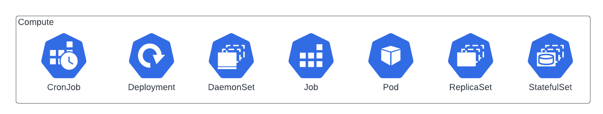
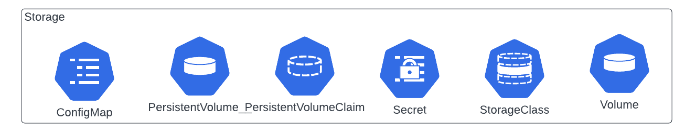
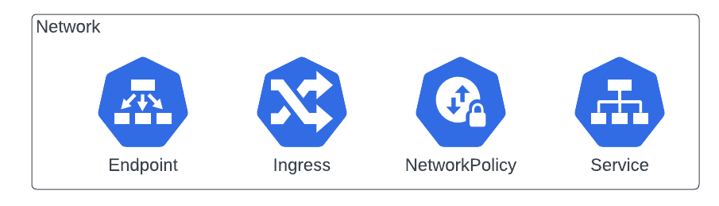
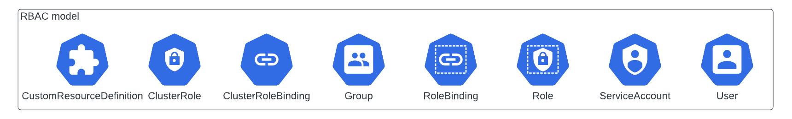
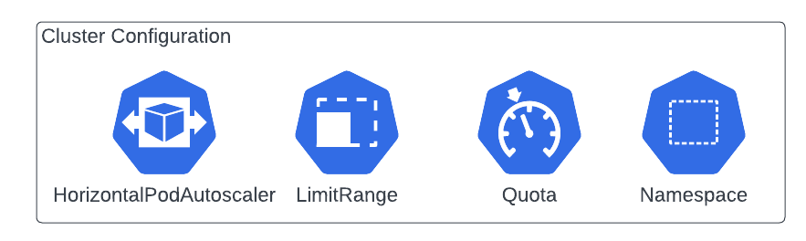
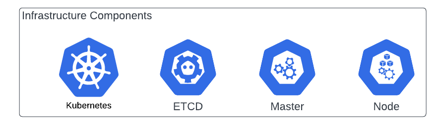
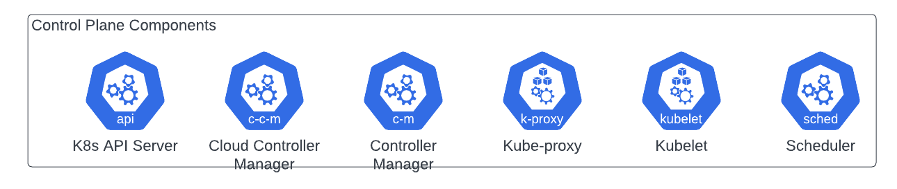

# Kubernetes terminology

I asked ChatGPT to give defintions and examples of the different Kubernetes resources. So, this terminology needs to be verified.

**Compute**

<!-- prettier-ignore -->
| Term| Definition | Example|
| - | - | - |
| CronJob | A Kubernetes resource that enables scheduling of Jobs to run at specific times or intervals| A CronJob that runs nightly backups of a database|
| Deployment| A Kubernetes resource that manages a set of identical Pods, ensuring they have the same configuration and scaling capabilities | A Deployment that runs a web server with 3 replicas|
| DaemonSet | A Kubernetes resource that ensures that a specific Pod runs on all or selected nodes in a cluster| A DaemonSet that ensures a monitoring agent is running on every node |
| Job | A Kubernetes resource that runs a single instance of a Pod to completion, ensuring that a specified number of successful completions occur | A Job that runs a batch process on a set of input files|
| Pod | The smallest unit of deployment in Kubernetes, a single instance of a container running in a cluster | A Pod that runs an instance of a web server|
| ReplicaSet| A Kubernetes resource that ensures a specified number of replicas of a Pod are running at all times, and can automatically adjust the number of replicas based on demand | A ReplicaSet that manages a set of 5 web servers |
| StatefulSet | A Kubernetes resource that manages a set of Pods, each with a unique and stable network identity, useful for stateful applications | A StatefulSet that manages a distributed database with each Pod having its own persistent volume |

**Storage**

<!-- prettier-ignore -->
| Term| Definition| Example|
| - | - | - |
| ConfigMap | A Kubernetes resource that stores configuration data in key-value pairs or files and makes them available to Pods | A ConfigMap that stores a database connection string |
| PersistentVolume| A Kubernetes resource that represents a piece of storage that can be provisioned and used by Pods | A PersistentVolume that is backed by a network-attached storage device |
| PersistentVolumeClaim | A Kubernetes resource that requests a specific amount of storage from a PersistentVolume| A PersistentVolumeClaim that requests 1GB of storage for a database|
| Secret| A Kubernetes resource that stores sensitive information such as passwords or API keys, in an encrypted form | A Secret that stores the username and password for a database|
| StorageClass| A Kubernetes resource that describes a class of storage available in a cluster, and provides a way to dynamically provision PersistentVolumes | A StorageClass that describes a class of storage backed by SSDs|
| Volume| A Kubernetes resource that provides a way for a Pod to access a piece of storage, either from a PersistentVolume or other storage provider| A Volume that provides access to a shared file system|

**Network**

<!-- prettier-ignore -->
| Term| Definition| Example|
| - | - | - |
| Endpoint| A stable network address that can be used to access a service running in a pod. | An endpoint might be used to connect to a database running in a Kubernetes cluster.|
| Ingress | An API object that manages external access to services in a cluster, typically by routing incoming traffic to the appropriate service based on rules defined in the Ingress resource. | An Ingress might be used to expose a web application to the internet.|
| NetworkPolicy | A Kubernetes resource that allows you to specify how pods are allowed to communicate with each other and with other network endpoints.| A NetworkPolicy might be used to restrict network traffic to a set of pods in a cluster. |
| Service | An abstraction layer that defines a logical set of pods and a policy by which to access them. | A Service might be used to expose a database to other pods in a Kubernetes cluster.|

**RBAC model**

<!-- prettier-ignore -->
| Term | Definition | Example|
| - | - | - |
| CustomResourceDefinition | A Kubernetes API extension that allows users to define custom resources with their own schemas and behavior. | CustomResourceDefinition allows users to create their own API objects, such as controllers, operators, and custom API objects. |
| ClusterRole| A set of permissions that can be applied to all resources in a Kubernetes cluster. | A ClusterRole named "admin" might have full control over all resources in a cluster. |
| ClusterRoleBinding | A way to bind a ClusterRole to a group or user.| A ClusterRoleBinding named "admin-binding" might bind the "admin" ClusterRole to the "admin" user group. |
| Group| A named collection of users. | A Group named "developers" might contain all developers who need access to a particular namespace in a cluster.|
| RoleBinding| A way to bind a Role to a group or user within a namespace.| A RoleBinding named "dev-binding" might bind a Role named "developer" to the "developers" group within a specific namespace. |
| Role | A set of permissions that can be applied to resources within a namespace.| A Role named "developer" might have read/write access to Pods and Services within a particular namespace.|
| ServiceAccount | An account that is used by a pod to access the Kubernetes API server.| A pod might use a ServiceAccount named "default" to access the Kubernetes API server.|
| User | A named entity that can authenticate to the Kubernetes API server. | A User named "jdoe" might authenticate with a client certificate to access a Kubernetes cluster. |

**Cluster configuration**

<!-- prettier-ignore -->
| Term| Definition| Example |
| - | - | - |
| HorizontalPodAutoscaler | A Kubernetes resource that automatically scales the number of replicas of a deployment or replicaset based on CPU utilization or other metrics. | A HorizontalPodAutoscaler might be used to automatically scale a web server deployment to handle increased traffic. |
| LimitRange| A Kubernetes resource that specifies the minimum and maximum resource limits that can be requested by a pod in a namespace. | A LimitRange might be used to ensure that pods in a namespace do not consume more than a certain amount of CPU or memory. |
| Namespace | A way to divide a Kubernetes cluster into virtual clusters. | A Namespace named "production" might contain resources for a production environment, while a Namespace named "development" might contain resources for a development environment. |
| PodSecurityPolicy | A Kubernetes resource that controls the security features that a pod can use. | A PodSecurityPolicy might be used to ensure that a pod does not run as root, or that it does not mount host paths.|
| Quota | A Kubernetes resource that limits the amount of compute resources that can be used by objects in a namespace. | A Quota might be used to limit the amount of CPU|

**Infrastructure components**

<!-- prettier-ignore -->
| Term | Definition| Example|
| - | - | - |
| Kubernetes | An open-source container orchestration system for automating deployment, scaling, and management of containerized applications. | Google Kubernetes Engine (GKE), Amazon Elastic Kubernetes Service (EKS)|
| ETCD | A distributed key-value store used to store the cluster's configuration data, state, and metadata.| Used by Kubernetes to store configuration and state data.|
| Master | A control plane node that manages the state of the cluster, schedules workloads, and performs other management functions. | In a Kubernetes cluster, the master runs components such as the API server, scheduler, and controller manager. |
| Node | A worker machine in Kubernetes that runs containers and workloads.| In a Kubernetes cluster, nodes run the Kubernetes runtime environment (such as Docker or containerd) and the kubelet process that communicates with the control plane. |

**Controle Plane components**

<!-- prettier-ignore -->
| Term | Definition | Example|
| - | - | - |
| K8s API Server | The control plane component that exposes the Kubernetes API, which is used by other components to communicate and perform operations on the cluster. | All Kubernetes control plane components communicate with the API server to coordinate cluster operations.|
| Cloud Controller Manager | A control plane component that interacts with the underlying cloud provider to manage resources, such as load balancers and storage volumes. | In a cloud-based Kubernetes deployment, the cloud controller manager handles cloud-specific resources, such as creating and managing load balancers in AWS or GCP. |
| Controller Manager | A control plane component that runs controllers that manage the state of resources in the cluster, such as ensuring the desired number of replicas for a deployment. | The controller manager runs several controllers, such as the ReplicaSet controller, Deployment controller, and StatefulSet controller. |
| Kube-proxy | A control plane component that manages network communication within the cluster, such as routing traffic between services and exposing services to the external network. | Kube-proxy runs on each node in the cluster and maintains network rules to enable communication between pods and services. |
| Kubelet| A node component that runs on each node in the cluster and is responsible for starting and stopping containers, and communicating with the control plane.| Kubelet monitors the state of containers and reports back to the control plane.|
| Scheduler| A control plane component that schedules workloads to run on nodes in the cluster, based on resource availability and other factors. | The scheduler ensures that workloads are distributed across the cluster, taking into account factors such as resource utilization, affinity and anti-affinity rules, and user-defined preferences. |

