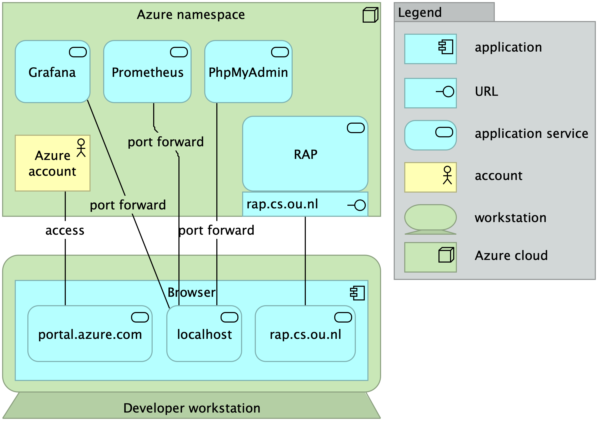

# Monitoring RAP in production
We want to monitor how RAP performs for all sorts of reasons.
When RAP goes down, monitoring results may help to diagnose the problem.
Monitoring results can be useful for knowing how many users use RAP.
However, we cannot afford to spend lots of effort on the monitoring software.
Therefore, we have built a generic monitoring solution that is easy to set up and reliable to use.

The monitoring solution runs on all Kubernetes based deployments of RAP
because we have implemented it as a number of manifest files that come with the RAP source code [in the RAP-repository](https://github.com/AmpersandTarski/RAP/tree/main/deployment/kubernetes/general/monitoring).
In this document, we explain the monitoring situation at the Open University, as an example that represents all other deployments as well.


## Monitoring setup
you need:
1. an Azure account to access the monitoring tools.
2. the namespace in which RAP is running. At the Open University, this is `ampersand-rap-aks-prd`.
3. the resource group from which RAP takes its resources. At the Open University, this is `kubernetes-prd`.
4. the name of the Prometheus server that is running in the monitoring namespace. At the Open University, this is `prometheus-service` and it runs on port 9090 of the Kubernetes cluster.
5. the name of the Grafana server that is running in the monitoring namespace. At the Open University, this is `grafana` and it runs on port 3000 of the Kubernetes cluster.

Services that need not be exposed to the outside world, such as Grafana and Prometheus, do not have a URL. You can access them by port forwarding to the Kubernetes cluster.
For this purpose, you need to first log in and then gain access by the following command in the commands prompt on your workstation:
   ```bash
   az login
   az aks get-credentials -g kubernetes-prd -n ampersand-rap-aks-prd --overwrite-existing
   ```
This command will give you access to the Kubernetes cluster in the resource group `kubernetes-prd` and the namespace `ampersand-rap-aks-prd`.
You can now port forward to the Prometheus service by the following commands:
   ```bash
   kubectl port-forward svc/prometheus-service -n monitoring 8002:9090
   ```
You can now access Prometheus by opening a browser and going to `http://localhost:8002`.
Access to the grafana service is similar:
   ```bash
   kubectl port-forward svc/grafana -n monitoring 8003:3000
   ```

## Monitoring practice
Currently, the monitoring environment is not stable yet, so we can say little about the monitoring practice.