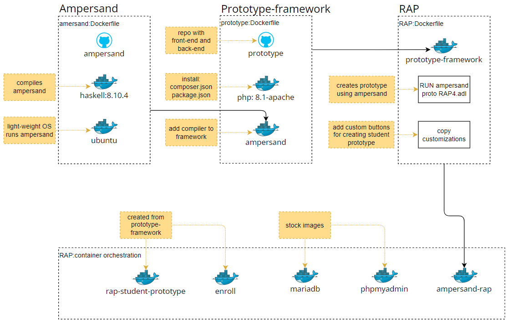
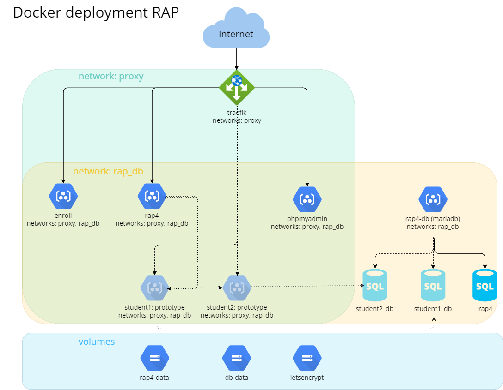
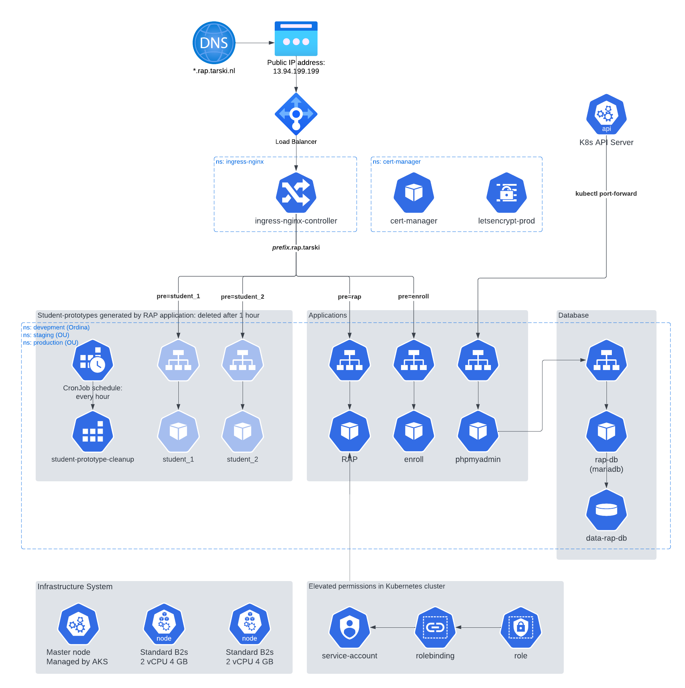
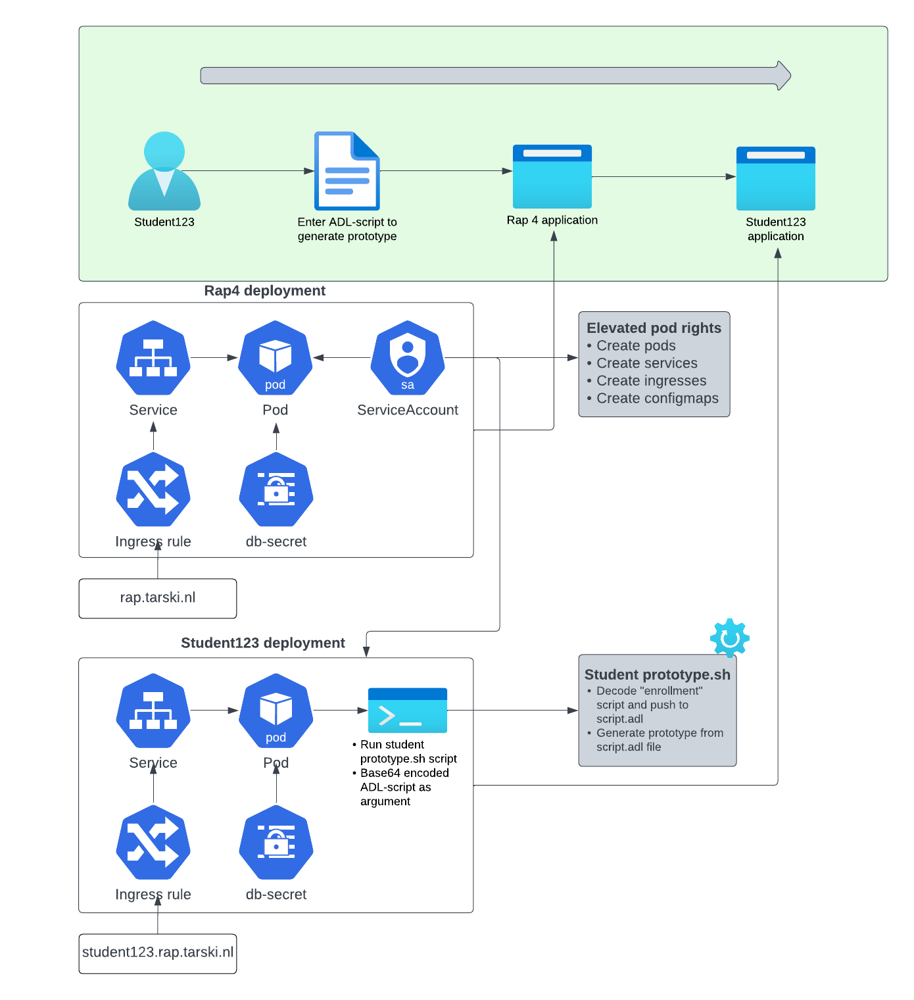

# Deployment of RAP

## Introduction

RAP is a tool that is being used by the Open University of the Netherlands in the course Rule Based Design. It lets students analyse Ampersand models, generate functional designs and make prototypes of information systems. It is the primary tool for students in relation to Ampersand.

The RAP application is an information system generated by Ampersand, consisting of an backend connected to a database, an API and a frontend application. As explained [here](https://ampersandtarski.gitbook.io/documentation/architecture-of-an-ampersand-application). The application generated by Ampersand has bootstrapped customized code, that enables users to upload a script in the [Ampersand language](https://ampersandtarski.gitbook.io/documentation/the-language-ampersand) and deploy a new information system generated by Ampersand. That again consists of a backend, API and frontend application.

This page explains how RAP application is deployed using Docker or Kubernetes.

## RAP docker image

To understand the contents of the RAP docker imager, it is important to discuss two other images first; Ampersand and Prototype-framework.

**Ampersand** ([repository](https://github.com/AmpersandTarski/Ampersand))
The application that checks and compiles ADL-scripts (business rules in Ampersand language). It returns a set of files (json and sql) containing the information system; backend, API and frontend and database queries.

The Ampersand application is compiled with Haskell, a light-weight Linux OS is included in the Docker image to run the Ampersand application.

**Prototype-Framework** ([repository](https://github.com/AmpersandTarski/prototype))
The php framework that transforms output files from the Ampersand application into a web application. The Ampersand application is included in the image, see the lines from the prototype Dockerfile below.

```
COPY --from=ampersandtarski/ampersand:v4.7 /bin/ampersand /usr/local/bin
RUN chmod +x /usr/local/bin/ampersand
```

Because Ampersand is included, the prototype framework can directly generate a new information system from an ADL-script. A database is still required.

**RAP** ([repository](https://github.com/AmpersandTarski/RAP))
The RAP application is created from the prototype-framework image, using the ADL-script with all business relation required. For example:

- Create user and login
- Show account and change password
- Add a new ADL-script (through a file upload or text field)
- List scripts

Custom code is bootstrapped to the framework, this code includes functionality not generated by Ampersand:

- Compile the users ADL-script
- Create a functional specifiction document
- Deploy a generated information system from the ADL-script
  - Docker-compose
  - Kubernetes Cluster

**Workflow image**


Your deployment platform should use the publically available [RAP image](https://hub.docker.com/r/ampersandtarski/ampersand-rap## "on Docker hub") to spin up a RAP container.
This image is built on the [Prototype-framework image](https://hub.docker.com/r/ampersandtarski/prototype-framework## "on Docker hub"),
which realizes RAP by generating a web-application hosted on nginx.
The prototype framework uses the [Ampersand image](https://hub.docker.com/r/ampersandtarski/ampersand## "on Docker hub") to compile the RAP source code.
All of the source code of [RAP](https://github.com/AmpersandTarski/RAP## "on GitHub"), [the Prototype Framework](https://github.com/AmpersandTarski/prototype## "on GitHub"), and [Ampersand](https://github.com/AmpersandTarski/Ampersand## "on GitHub") is open sourced and is maintained by the Ampersand core team. CI/CD pipelines for the Ampersand compiler, the prototype framework and RAP are in place, so releases are published automatically.

An Ampersand script is a file (typically with extension .adl) that specifies an information system.
The Ampersand compiler checks and compiles Ampersand scripts. It returns a set of files (json and sql) containing the essence of the information system.
The compiler runs in a light weight Linux docker container.

This PHP framework generates RAP as a web-application from the files delivered by the Ampersand compiler. It includes a copy of the Ampersand compiler because RAP uses the same compiler to compile scripts made by users.

Besides the generated code, RAP contains customizations that are found in the RAP repo, under `RAP>RAP4>customizations`.
For the purpose of authorizing users, it uses the SIAM4 framework, which has been copied into the source code of RAP.

The deployment of RAP contains:

1. a RAP container, which offers the functionality of RAP;
2. a MariaDB container to store persistent data;
3. a phpMyAdmin container, to inspect the database;
4. an Enroll container, which is an application just for demonstration purposes.
5. rap-student-prototype A very minimal application generated by Ampersand that has an entry point for Ampersand scripts. When this container is spun up, an Ampersand script is injected to create a new information system.
6. a Prometheus container to scrape metrics from the running containers. These metrics can in turn be used to monitor the health of the cluster. It also throws alerts for when metrics exceed their desired value.
7. a Grafana container used for visualising the Prometheus data.

## Deployment on Docker

This section explains the structure of a docker deployment, to help understanding it. [Instructions](./docker-deployment-guide) are in the Guides section.

The file [docker-compose.yml](https://github.com/AmpersandTarski/RAP/blob/main/docker-compose.yml) defines the deployment of RAP, as depicted in this diagram:

It contains:

- A reverse proxy, Traefik, to direct traffic from the URL to the correct services;
- Two virtual networks, to separate database traffic from external traffic;
- Applications (Enroll, RAP, phpMyAdmin, MariaDB), each in a container of its own, to isolate each application.
- 3 volumes, to realize the persistent storages in cloud contexts:
  - rap4-data contains copies of user's Ampersand scripts and documents;
  - db-data contains the data managed by MariaDB;
  - letsencrypt contains certificates for https traffic.

RAP, Enroll, MariaDB and phpMyAdmin are running perpetually. From the RAP application student prototypes are spun up, which run temporarily.

### Student-prototype

Students who use RAP can store an Ampersand script, compile it towards a container and run it for roughly an hour to experiment with it.

To compile and run an Ampersand script
The RAP application uses the docker-[cli](## "Command-Line Interpreter") to run a student's Ampersand script.
It issues the following command:

```
echo <<base64 encoded zip containing the adl scripts>> <<base64 encoded starting script name>> | docker run --name <<student-name>> <<other options>> ampersandtarski/rap4-student-prototype:<<image version>>
```

The prototypes of multiple students can run in parallel.
Every student can run only one prototype at a time.

## Deployment on Kubernetes

### Kubernetes commands

Kubernetes makes use of the Kubernetes control (kubectl) command-line interface.
For deployment two command are of the essence:

- `kubectl apply -f <<filename>>`
- `kubectl apply -k <<foldername>>`

The first is used for single file deployments.
The second is used for Kustomization deployment.

### Kustomize

Kustomize is tool for deploying multiple resources with a single command. It works by reading out a `kustomization.yaml` file located in the given folder. It then collects resources specified, applies any patches (e.g. add a suffix or change an environment variable) and deploys all gathered resources.
In this project there are three 'sets' of kustomizations:

- general: these are the same for each cluster, but only one is required per cluster.
- base: the base resource files.
- overlays: patches and additions to the base resources.

By using kustomize only two commands are required to deploy RAP to kubernetes (plus one for each additional namespace).

```
kubectl apply -k <<general directory path>>
kubectl apply -k <<overlay directory path>>
```

### Architecture

The Kubernetes deployment chart consists of several components that work together to provide a robust and scalable platform for running the RAP application. The architecture includes the following:

- DNS routing
- Ingress Nginx Controller with letsencrypt
- Application components (Enroll, RAP, PhpMyAdmin, MariaDB)
- Monitoring components (Prometheus, and Grafana)
- Persistent Storage to store the RAP database and student scripts.
- Scheduled job (CronJob) to cleanup student prototypes
- Service Account
- Infrastructure (nodes) to host the application

**Architecture figure**


## External routing

A user of RAP enters the URL of RAP in her browser.
The Kubernetes cluster receives this traffic.
The Kubernetes cluster uses an Azure public IP address.
Azure forwards this traffic through a load balancer to the ingress controller of the RAP application.

A seperate document is available explaining how to create the Kubernetes cluster on Azure using Azure Kubernetes Service: [Preparing Kubernetes environment on Azure](preparing-azure.md)

## Kubernetes objects

In this section all Kubernetes objects required in the cluster are defined.

Below the most important terms for Kubernetes are listed.

**Infrastructure terminology**
<!-- prettier-ignore -->
| Term | Definition |
| - | - |
| Kubernetes object | Describe the desired state of your application, such as what container images to use, how many replicas to run, and what resources to allocate. Kubernetes objects include resources such as Deployments, Services, ConfigMaps, Secrets, Jobs, CronJobs, and many others. |
| Container​ | A lightweight and portable executable unit that contains application code, libraries, and dependencies, and is run by a pod. Containers provide a consistent runtime environment across different infrastructure platforms.​ |
| Pod​ | The smallest and simplest Kubernetes object. A pod encapsulates one or more containers and provides them with a shared network namespace, shared storage, and an IP address. Pods are scheduled on nodes and communicate with the Kubernetes API server.​ |
| Node | A worker machine in a Kubernetes cluster that runs pods. A node can be a physical machine or a virtual machine, and it has all the necessary services to run containers, such as Docker or containerd. Nodes are managed by the control plane components of the Kubernetes master.​ |
| Cluster | A set of nodes that run containerized applications managed by Kubernetes. A cluster typically consists of a master node and one or more worker nodes. The master node manages the control plane components of the Kubernetes system, while the worker nodes run the applications. |​
| Cluster network | The network that connects the nodes in a Kubernetes cluster and facilitates communication between them. The cluster network is divided into two parts: the pod network, which is used for communication between pods, and the service network, which is used for communication between services.​ |
| Ingress | An API object that manages external access to the services in a Kubernetes cluster. Ingress exposes HTTP and HTTPS routes from outside the cluster to services within the cluster. Traffic routing is controlled by rules defined on the Ingress resource.​ |

The most important definitions of Kubernetes objects are in the table below.

<!-- prettier-ignore -->
| Term | Definition |
| - | - |
| Namespace | A virtual cluster that provides a way to divide cluster resources between multiple users, teams, or applications. Namespaces enable you to create virtual clusters within a physical cluster. Objects within a namespace are isolated from objects in other namespaces. |
| Deployment | A Kubernetes object that manages a set of replica pods and their associated configuration. Deployments enable you to manage applications and their scaling, rolling updates, and rollbacks. A specific .yaml file, the manifest, describes the deployment declaratively. |
| Service | An abstraction that defines a set of pods and a policy for accessing them. Services enable loose coupling between dependent pods by providing a stable IP address and DNS name for a set of pods that perform the same function. |
| Ingress rule | An Ingress rule is a Kubernetes resource that defines how incoming requests to a particular service should be routed within a cluster. It specifies the rules for mapping external traffic to internal services, based on criteria such as the URL path, the host name, or the request headers. |
| ConfigMap | A Kubernetes object that provides a way to decouple configuration data from application code. ConfigMaps enable you to store key-value pairs or configuration files as objects in the Kubernetes API, and mount them as volumes or environment variables in a container. |
| Secret | A Kubernetes object that provides a way to store and manage sensitive information, such as passwords, API keys, and certificates. Secrets enable you to decouple sensitive data from application code and manage it separately. |
| Job | A Kubernetes object that creates one or more pods and ensures that a specified number of them successfully complete. Jobs enable you to run batch or single-task jobs, such as backups, migrations, or data processing. |
| CronJob | A Kubernetes object that creates a job on a regular schedule, based on a cron-like syntax. CronJobs enable you to run batch or single-task jobs on a recurring basis, such as daily backups, weekly |

### Ingress Nginx Controller

The Ingress Nginx Controller is a Kubernetes resource that acts as a reverse proxy and load balancer for HTTP and HTTPS traffic. It receives incoming traffic and routes it to the appropriate service or pod within the Kubernetes cluster based on the configured rules.

The Ingress Nginx Controller is created using a Helm chart. First add the Ingress Controller to your local Helm repository:

```
helm repo add ingress-nginx https://kubernetes.github.io/ingress-nginx
helm repo update
```

Next export the Helm deployment as a template.

```
helm template ingress-nginx ingress-nginx/ingress-nginx `
    --version 4.5.2 `
    --namespace ingress-nginx `
    --create-namespace `
    --set controller.replicaCount=2 `
    --set controller.service.annotations."service\.beta\.kubernetes\.io/azure-load-balancer-health-probe-request-path"=/healthz `
    --set controller.service.loadBalancerIP=<<YourIPAdrress>> `
    > <<filename>>.yaml
```

The generated output file can be deployed to the cluster directly or as part of a Kustomization. To deploy use the appropriate [deployment command]{#kubernetes-commands}.

Helm cli uses the active kubectl cli, directly adding the controller to your Kubernetes cluster is done with the command `helm create ingress-...`

The nginx ingress controller is deployed in the namespace `ingress-nginx`, only one nginx controller is required for multiple namespaces (development, staging, production).

<!-- prettier-ignore -->
| Name | Purpose | File |
| - | - | - |
| ingress-nginx-namespace.yaml  | Namespace                     | [link](https://github.com/AmpersandTarski/RAP/blob/main/deployment/kubernetes/general/ingress/ingress-nginx-namespace.yaml) |
| ingress-nginx-controller.yaml | Ingress controller Helm chart | [link](https://github.com/AmpersandTarski/RAP/blob/main/deployment/kubernetes/general/ingress/ingress-nginx-controller.yaml) |

### Let's encrypt & cert manager

The Ingress Nginx Controller works together with Let’s Encrypt to secure the connection. Let's Encrypt is a Certificate Authority (CA) that provides an easy way to obtain and install free TLS/SSL certificates, thereby enabling encrypted HTTPS on web servers. It simplifies the process by providing a software client, Certbot, that attempts to automate most (if not all) of the required steps. Currently, the entire process of obtaining and installing a certificate is fully automated on both Apache and Nginx. Cert manager is a set of custom resource definitions (CRD) and service accounts and roles that allow let's encrypt to do its work.

```
helm template `
    cert-manager jetstack/cert-manager `
    --namespace cert-manager `
    --set installCRDs=true `
    > <<filename>>.yaml
```

The generated output file can be deployed to the cluster directly or as part of a Kustomization. To deploy use the appropriate [deployment command]{#kubernetes-commands}.

The certificate manager is deployed in the namespace `cert-manager`, only one certificate manager is required for multiple namespaces (development, staging, production).

Besides cert manager, a let's encrypt Issuer should be deployed which issues the certificate. Let's encrypt provides two Issuers:

- [Staging Issuer](https://github.com/AmpersandTarski/RAP/blob/main/deployment/kubernetes/overlays/general/dev/certmanager/letsencrypt-staging.yaml)
- [Production Issuer](https://github.com/AmpersandTarski/RAP/blob/main/deployment/kubernetes/overlays/general/dev/certmanager/letsencrypt-production.yaml)

The staging Issuer will issue a fake certificate. This is useful for development purposes to test the connection. Once everything works, only the production Issuer is used. As an Issuer only issues certificated for resources within its own namespace, each namespace requires its own Issuer.

<!-- prettier-ignore -->
| Name | Purpose | File |
| - | - | - |
| cert-manager-namespace.yaml | Namespace | [link](https://github.com/AmpersandTarski/RAP/blob/main/deployment/kubernetes/general/certmanager/cert-manager-namespace.yaml) |
| cert-manager.yaml | Certificate manager Helm chart | [link](https://github.com/AmpersandTarski/RAP/blob/main/deployment/kubernetes/general/certmanager/cert-manager.yaml) |
| letsencrypt-production.yaml | ClusterIssuer | [link](https://github.com/AmpersandTarski/RAP/blob/main/deployment/kubernetes/overlays/general/dev/certmanager/letsencrypt-production.yaml) |
| letsencrypt-staging.yaml | ClusterIssuer for testing purposes (to avoid exceeding rate limit) | [link](https://github.com/AmpersandTarski/RAP/blob/main/deployment/kubernetes/overlays/general/dev/certmanager/letsencrypt-staging.yaml) |

**Rate limit**
Let's encrypt uses rate limits. The maximum certificates per registered domain is 50 per week. Depending on the number of enrolled students, it might be possible to exceed this limit. If this is the case, it should be possible to request a wildcard certificate for the domain `*.rap.tarski.nl`.

Check the [let's encrypt website](https://letsencrypt.org/docs/rate-limits/) for more information on the rate limit and [this announcement](https://community.letsencrypt.org/t/acme-v2-production-environment-wildcards/55578) on how to request a wildcard certificate.

### Namespace

Before other resources are deployed, the namespace to which you are deploying said resources needs to be created. Typically namespaces are development, staging and/or production.

<!-- prettier-ignore -->
| Name | Purpose | File |
| - | - | - |
| namespace.yaml | Namespace | [link](https://github.com/AmpersandTarski/RAP/blob/main/deployment/kubernetes/overlays/general/dev/rap/namespace.yaml) |

### Enroll

The Enroll Pod is a containerized application that is used as an example in this context. It is a generated information system from the rap application. The purpose of the system is to enroll students for modules.

Consists of the following files:

<!-- prettier-ignore -->
| Name | Purpose | Base | Patch |
| - | - | - | - |
| enroll-deployment.yaml | Docker image, environmental variables                        | [link](https://github.com/AmpersandTarski/RAP/blob/main/deployment/kubernetes/base/enroll/enroll-deployment.yaml) | [link](https://github.com/AmpersandTarski/RAP/blob/main/deployment/kubernetes/overlays/local/dev/enroll/enroll-deployment.yaml) |
| enroll-service.yaml    | Creates ClusterIP such that traffic can be routed to the pod | [link](https://github.com/AmpersandTarski/RAP/blob/main/deployment/kubernetes/base/enroll/enroll-service.yaml) | N/A |
| enroll-ingress.yaml    | Ingress rule                                                 | [link](https://github.com/AmpersandTarski/RAP/blob/main/deployment/kubernetes/base/enroll/enroll-ingress.yaml) | [link](https://github.com/AmpersandTarski/RAP/blob/main/deployment/kubernetes/overlays/local/dev/enroll/enroll-ingress.yaml)      |

### RAP

The RAP Pod is a containerized application that is used to generated information systems. The tool stores ampersand-script in which the user can specify, analyze and build information systems.

Before installing make sure that the two variables in `administration-configmap` - `AMPERSAND_PRODUCTION_MODE` and `DISABLE_DB_INSTALL` - are both set to `false`. This is to ensure that the database is properly installed and accessable.

To avoid database resets after the first installation, both should be turned to `true` after installing the database. Changes to configurations do not take effect when updating a config map. For the configuration to take effect the pod running the RAP container should be restarted.

This can be done through the (Azure) portal, or by using Kubernetes CLI:

```
# get the pod name
$POD = kubectl get pods -n <<namespace>> -l app=rap -o jsonpath='{.items[0].metadata.name}'
# delete the pod (the Deployment will restart the pod)
kubectl delete pod $POD -n <<namespace>>
```

Consists of the following files:

<!-- prettier-ignore -->
| Name | Purpose | Base | Patch |
| - | - | - | - |
| rap-deployment.yaml | Docker image, environmental variables | [link](https://github.com/AmpersandTarski/RAP/blob/main/deployment/kubernetes/base/rap/rap-deployment.yaml) | [link](https://github.com/AmpersandTarski/RAP/blob/main/deployment/kubernetes/overlays/local/dev/rap/rap-deployment.yaml) |
| rap-service.yaml | Creates ClusterIP such that traffic can be routed to the pod | [link](https://github.com/AmpersandTarski/RAP/blob/main/deployment/kubernetes/base/rap/rap-service.yaml) | N/A |
| rap-ingress.yaml | Ingress rule | [link](https://github.com/AmpersandTarski/RAP/blob/main/deployment/kubernetes/base/rap/rap-ingress.yaml) | [link](https://github.com/AmpersandTarski/RAP/blob/main/deployment/kubernetes/overlays/local/dev/rap-ingress.yaml) |
| administration-configmap.yaml | Administration ConfigMap | [link](https://github.com/AmpersandTarski/RAP/blob/main/deployment/kubernetes/base/rap/administration-configmap.yaml) | N/A |

### phpMyAdmin

The phpMyAdmin Pod is a containerized application that provides a graphical user interface for managing the MariaDB MySQL database that is used by the rap application. This pod contains the necessary software, libraries, and configuration files to run the phpMyAdmin service for your application.

To access phpMyAdmin you need access through the Kubernetes CLI. Create a port-forwarding service to your localhost:

```
# create port-forwarding
kubectl port-forward svc/<<service name>> -n <<namespace>> 8080:8080
```

Then you can access phpMyAdmin on [http://localhost:8080](http://localhost:8080)

| Name | Purpose | File |
| - | - | - |
| phpMyAdmin.yaml         | phpMyAdmin Helm chart | [link](https://github.com/AmpersandTarski/RAP/blob/main/deployment/kubernetes/base/rap/phpMyAdmin.yaml) |

### MariaDB

The Rap4-DB Pod is a containerized MariaDB MySQL database instance that is used by your application. This pod contains the necessary software, libraries, and configuration files to run the MariaDB service for the rap application.

<!-- prettier-ignore -->
| Name | Purpose | File |
| - | - | - |
| db-secrets.yaml | Secret with username and password to connect to database, used by multiple resources | [link](https://github.com/AmpersandTarski/RAP/blob/main/deployment/resources/db-secrets.yaml) |
| db-users.yaml   | ConfigMap used to create database user and password with privileges                  | [link](https://github.com/AmpersandTarski/RAP/blob/main/deployment/resources/db-users-configmap.yaml) |
| mariadb.yaml    | MariaDB Helm chart                                                                   | [link](https://github.com/AmpersandTarski/RAP/blob/main/deployment/resources/mariadb.yaml) |

By default a root user with password is created by the Helm chart. To add another user in the manifest file, a ConfigMap is created, which is called when the mariadb manifest is created.

ConfigMap:

```
apiVersion: v1
kind: ConfigMap
metadata:
  name: db-users
  namespace: rap
data:
  create-user.sql: |-
    CREATE USER '<<username>>'@'%' IDENTIFIED BY '<<password>>';
    GRANT ALL PRIVILEGES ON *.* TO '<<username>>'@'%';
```

Reference configMap in the mariadb deployment volumes:

```
volumes:
  - name: mysql-inituser
    configMap:
      name: db-users
```

And the volumeMounts to call the sql script when the template is created.

```
volumeMounts:
  - name: mysql-inituser
  mountPath: /docker-entrypoint-initdb.d
```

### Student-prototype

Student-prototype is a deployment with the image `ampersandtarski/rap4-student-prototype`. This is included such that the image file is in the Kubernetes Cluster memory. When creating a student-prototype with RAP, the image doesn't have to be downloaded.

<!-- prettier-ignore -->
| Name | Purpose | File |
| - | - | - |
| student-prototype-deployment.yaml | Load docker image into Kubernetes cluster | [link](https://github.com/AmpersandTarski/RAP/blob/main/deployment/resources/student-prototype-deployment.yaml) |

### Student-prototype cleanup

A CronJob is included in the Kubernetes Cluster that runs every hour to delete student-prototypes, in order to prevent an excessive number of such pods from proliferating.

The CronJob is scheduled to be triggered every hour. When it is triggered, a Job is started that uses a stock container image that can communicate with the Kubernetes API: `image: bitnami/kubectl:latest`.

To give the Pod permission to delete pods, a service account is coupled: `name: student-prototype-cleanup`.

When the container is spun up, arguments are passed that loop over all deployments with the label `container-image=student-prototype`. Checks if the deployment is older than 1 hour and deletes the deployment, service and ingress rule.

```
# loop all deployments with label: container-image=student-prototype
for deployment in $(kubectl get deployment -n rap -l container-image=student-prototype -o jsonpath='{.items[*].metadata.name}'); do
    # calculate age in seconds
    deployment_age=$(($(date +%s) - $(date +%s -d $(kubectl get deployment $deployment -n rap -o jsonpath='{.metadata.creationTimestamp}'))))
    # delete deployment, service and ingress if age > 1 hour
    if [ $deployment_age -gt 3600 ]; then
        echo "Deleting deployment $deployment"
        kubectl delete deployment $deployment -n rap
        kubectl delete service $deployment -n rap
        kubectl delete ingress $deployment-ingress -n rap
        # TODO: delete database tables?
    else
        echo "Deployment $deployment is not older than 1 hour"
    fi
done
```

<!-- prettier-ignore -->
| Name | Purpose | File |
| - | - | - |
| student-prototype-cleanup.yaml | Delete student-prototypes older than 1 hour | [link](https://github.com/AmpersandTarski/RAP/blob/main/deployment/resources/student-prototype-cleanup.yaml) |

# Deep dive RAP

This chapter is meant as a deep dive and is divided into two sections. The first section will provide an explanation of the workflow and deployments. The second section will demonstrate how the design choices, from Docker to Kubernetes, were put into practice.

## Workflow and deployments overview

### Workflow

The following overview outlines the workflow for creating a prototype as a student. The student will first log into the RAP website, create an Ampersand script, compile it, and then generate the prototype based on the script.


### RAP deployment

The deployment of RAP involves several manifest files, including deployment, ingress rule, service, service account, and configmap files. The service account is a critical component for generating the student prototype application since it contains RBAC (Role Based Access Control) permissions that enable it to deploy resources to a Kubernetes cluster. Service accounts are used to connect to the Kubernetes API Server. In this case, the RAP service account has been granted rights to create, modify and delete pods, services, ingresses, and configmaps. By granting these rights, a new student prototype can be configured.

The deployment file pulls the image `ampersandtarski/ampersand-rap:2023-08-08` from the ampersandtarski repository and uses configmaps as environment variables. The RAP pod connects to the database, using the Secret `db-secrets`. `db-secrets` contains the root password for the MYSQL database, the MYSQL user, and password. The mysql rap4-db is accessed with these values. Configuration data such as the server URL, Ampersand user and log configuration is included as environmental variable in the container specifications.

The service and ingress rule are used to reach the RAP application from an external entry point. The ClusterIP service exposes the pod to a web server, and the ingress routes incoming requests to the web-server service based on the path. In this case, the path is `rap.tarski.nl`.

### Student123 deployment

The deployment of student123 involves several manifest files, including deployment, ingress rule and service.

The deployment manifest file pulls the image `ampersandtarski/rap4-student-prototype:v1.1.1` from the ampersandtarski repository. The student Ampersand script that is referred to in the workflow is added as a base64-encoded argument in the manifest file. Once the pod starts, it first runs the run-student-proto bash script. This script decodes the base64-encoded text and writes the content to a script.adl file. This script.adl file generates the prototype with the Ampersand compiler.

The `db-secrets` Secret of the RAP and student123 deployment are the same, because the pod is connecting to the same MYSQL database. The environmental variables in the student container specification are student specific.

The service and ingress rule are used to reach the student123 application from an external entry point. The ClusterIP service exposes the pod to a web server, and the ingress routes incoming requests to the web-server service based on the path. In this case, the path is `student123.rap.tarski.nl`.

## Docker to Kubernetes

This section will demonstrate the implementation of design choices from Docker to Kubernetes.

In the Docker setup, the student prototype application was started from the RAP application by using the Docker daemon on the host machine, from the RAP container. This was accomplished by mounting the volume /var/run/docker.sock:/var/run/docker.sock to the RAP 4 deployment in the Docker Compose file.

A similar approach in Kubernetes involves using the Kubernetes API to create a resource, for which a service account is used. This is explained in the RAP deployment chapter. Once the RAP 4 pod has been granted rights to create a new pod, The Kubernetes API needs to be installed to apply the manifest files of the new resource.

In order to make this whole deployment work in the kubernetes architecture the following changes have to been made to the ampersand rap docker file.

**Add kubectl**
RAP Dockerfile is updated to include Kubernetes API:

```
RUN apt update && \
    apt install -y curl && \
    curl -LO https://storage.googleapis.com/kubernetes-release/release/`curl -s https://storage.googleapis.com/kubernetes-release/release/stable.txt`/bin/linux/amd64/kubectl && \
    chmod +x ./kubectl && \
    mv ./kubectl /usr/local/bin/kubectl
```

**Include student-prototype-manifest.yaml**
A Kubernetes manifest files ([link](https://github.com/AmpersandTarski/RAP/blob/main/RAP4/customizations/bootstrap/files/student-manifest-template.yaml)) is included in the RAP container. This manifest consists of the deployment, service and ingress rule.

Part of the deployment is printed below. When a student prototype is generated, the manifest file is copied to a unique student folder. Three variables are replaced with student specific values:

| Variable          | Description                                                            |
| ----------------- | ---------------------------------------------------------------------- |
| {{student}}       | Student user name                                                      |
| {{namespace}}     | Namespace of the Kubernetes Cluster (development, staging, production) |
| {{scriptContent}} | base64 decoded student Ampersand script                                      |

```
apiVersion: apps/v1
kind: Deployment
metadata:
  name: {{student}}
  namespace: {{namespace}}
  labels:
    app: {{student}}
    container-image: student-prototype
spec:
  ...
    spec:
      containers:
        - name: {{student}}
          image: sheriffbalunywa/rap4-student-proto:2.1
          ...
          command: ["bash", "/run-student-prototype2.sh"]
          args: [{{scriptContent}}]
```

**Update custom code to run student-prototype**
The custom code used to deploy is updated to work for both Docker and
Kubernetes, if the environmental variable `RAP_DEPLOYMENT` exists and is equal to "Kubernetes", the student-prototype is deployed with Kubernetes CLI:

```
kubectl apply -f <<student-prototype-manifest.yaml>>
```

Otherwise using Docker CLI

```
echo <<base64 encoded Ampersand script>> | docker run --name <<student-name>> ampersandtarski/rap4-student-prototype:v1.1.1
```

### Student123 prototype scripting files

The student prototype container is started by calling the Docker run command in the code. The content of the `scriptContentForCommandline` variable, which refers to the "enrollment" script in the workflow, is base64 encoded and written to the Docker stdin. When the container starts, it runs the **run-student-pro&#46;sh** script, which places the stdin content into the script.adl file. This file is then used to generate the Ampersand prototype.

In Kubernetes, the student prototype container starts when the student123 manifest file is applied. The **running-student-prototype2&#46;sh** script is used in Kubernetes, which is adjusted for Kubernetes and refers to the new script. The command field, which specifies the entry point of the pod, is set to `["bash", "/run-student-prototype2.sh"]`, while the args field refers to the "enrollment" script in the workflow, which is also base64 encoded. The argument of the Kubernetes file is placed into the script.adl file, which is then used to generate the Ampersand prototype.
