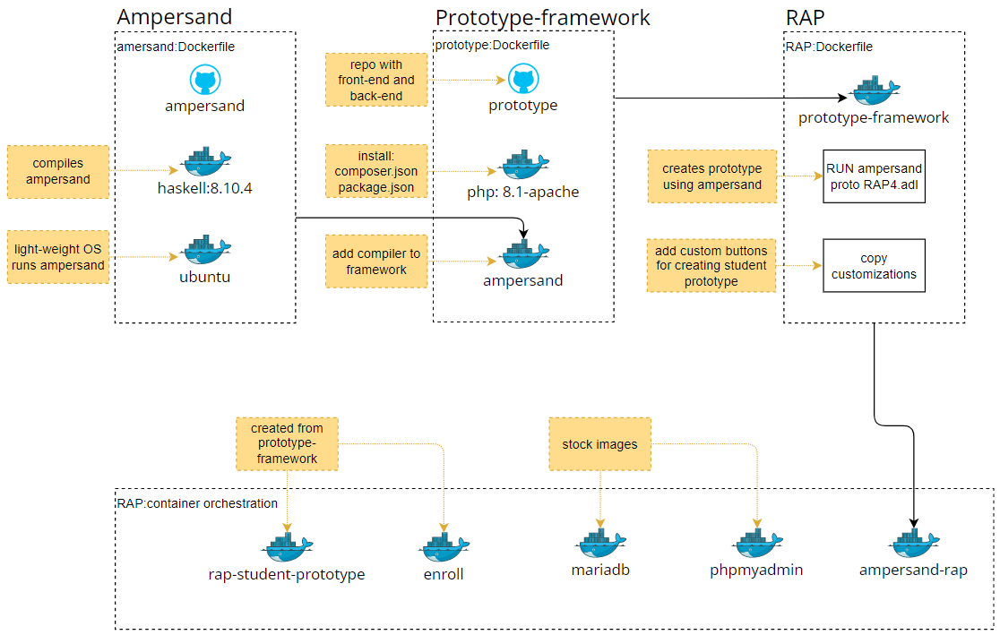
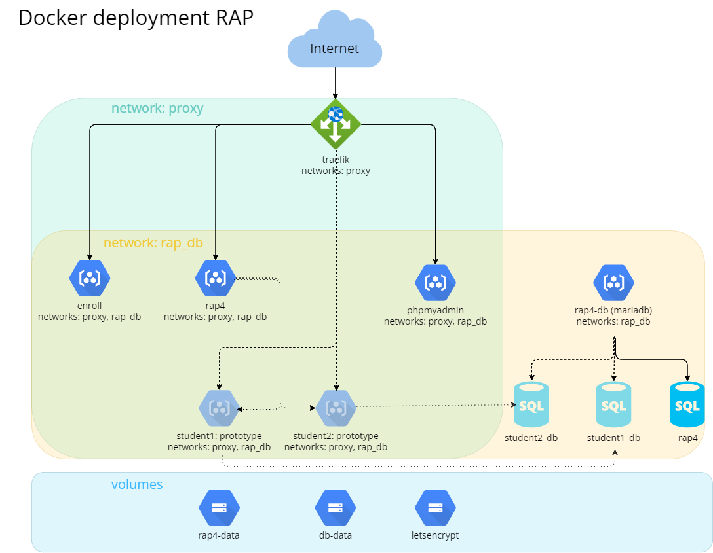
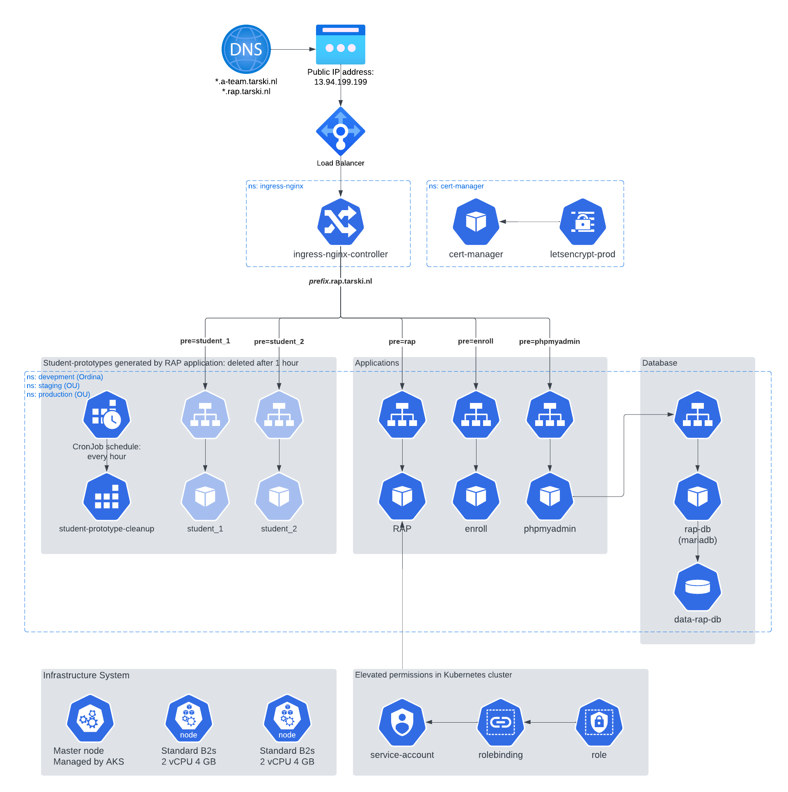
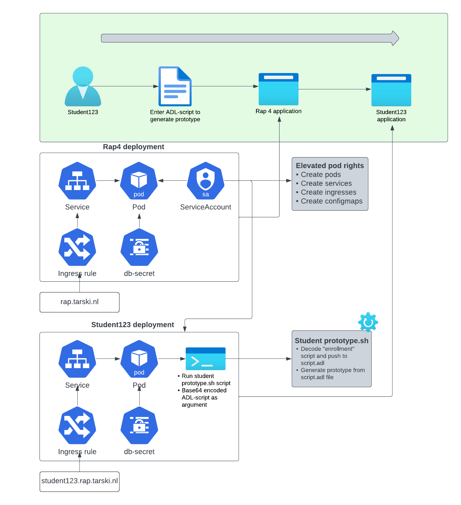

# Deployment of RAP

## Introduction

RAP is a tool that is being used by the Open University of the Netherlands in the course Rule Based Design. It lets students analyse Ampersand models, generate functional designs and make prototypes of information systems. It is the primary tool for students in relation to Ampersand.

The RAP application is an information system generated by Ampersand, consisting of an backend connected to a database, an API and a frontend application. As explained [here](https://ampersandtarski.gitbook.io/documentation/architecture-of-an-ampersand-application). The application generated by Ampersand has bootstrapped customized code, that enables users to upload a script in the [Ampersand language](https://ampersandtarski.gitbook.io/documentation/the-language-ampersand) and deploy a new information system generated by Ampersand. That again consists of a backend, API and frontend application.

This page explains how RAP application is deployed using Docker or Kubernetes.

## RAP docker image

To understand the contents of the RAP docker imager, it is important to discuss two other images first; Ampersand and Prototype-framework.

**Ampersand** ([repository](https://github.com/AmpersandTarski/Ampersand))
The application that checks and compiles ADL-scripts (business rules in Ampersand language). It returns a set of files (json and sql) containing the information system; backend, API and frontend and database queries.

The Ampersand application is compiled with Haskell, a light-weight Linux OS is included in the Docker image to run the Ampersand application.

**Prototype-Framework** ([repository](https://github.com/AmpersandTarski/prototype))
The php framework that transforms output files from the Ampersand application into a web application. The Ampersand application is included in the image, see the lines from the prototype Dockerfile below.

```
COPY --from=ampersandtarski/ampersand:v4.7 /bin/ampersand /usr/local/bin
RUN chmod +x /usr/local/bin/ampersand
```

Because Ampersand is included, the prototype framework can directly generate a new information system from an ADL-script. A database is still required.

**RAP** ([repository](https://github.com/AmpersandTarski/RAP))
The RAP application is created from the prototype-framework image, using the ADL-script with all business relation required. For example:

- Create user and login
- Show account and change password
- Add a new ADL-script (through a file upload or text field)
- List scripts

Custom code is bootstrapped to the framework, this code includes functionality not generated by Ampersand:

- Compile the users ADL-script
- Create a functional specifiction document
- Deploy a generated information system from the ADL-script
  - Docker-compose
  - Kubernetes Cluster

**Workflow image**



## Container orchestration

As shown in the workflow figure above, the RAP application is deployed together with 4 other application, either using Docker-compose or Kubernetes.

**rap-student-prototype**
A very minimal application generated by Ampersand that has an entry point for ADL-scripts. When this container is spun up, an ADL-script is injected to create a new information system.

**enroll**
A demo application generated by Ampersand.

**mariadb en phpmyadmin**
Mariadb is the database used by RAP, enroll and student prototypes. Phpmyadmin to view the database contents.

# Docker deployment

## Architecture

The figure below shows how the container orchestration is configured in docker compose.

**Reverse-proxy**
Traefik, in combination with let's encrypt, is used as reverse proxy to route external traffic to the different containers.

**Networks**
Two virtual networks are created.

The proxy network contains the traefik reverse proxy, that handles external traffic to containers in the virtual network. All containers except the database are running inside the proxy network.

The rap_db network cannot be accessed from an external source. All containers are included in this network and can therefor make SQL queries.

**Volumes**
The mariadb database and let's encrypt have persistant volumes for data storage.

**Applications**
RAP, enroll, mariadb and phpmyadmin are running continually. From the RAP application student prototypes are spun up, that run temporarily.

**Student-prototype**
A student prototype is an information system generated with the RAP application. The student ADL-script is checked with Ampersand compiler and encoded as base64.

The RAP application has Docker-cli installed and runs a new container with the following command:

```
echo <<base64 encoded ADL-script>> | docker run --name <<student-name>> ampersandtarski/rap4-student-prototype:v1.1.1
```

The student-prototype container runs for 1 hour and is ended automatically.

Multiple student prototypes can run in parallel.

**Architecture figure**


## Deployment

The deployment of RAP with Docker-compose is elaborated [here](https://github.com/AmpersandTarski/RAP/blob/main/README.md).

# Kubernetes deployment

## Architecture

The Kubernetes deployment chart consists of several components that work together to provide a robust and scalable platform for running the RAP application. The architecture includes the following:

- DNS routing
- Ingress Nginx Controller with letsencrypt
- Resources (Enroll, RAP, PhpMyAdmin, MariaDB)
- Persistant Storage
- Scheduled job (CronJob) to cleanup student prototypes
- Service Account
- Infrastructure (nodes)

**Architecture figure**


## External routing

Traffic to the Kubernetes cluster is routed from a DNS service to an Azure public IP address. A load balancer forwards traffic to the ingress controller.

A seperate document is available explaining how to create the Kubernetes cluster on Azure using Azure Kubernetes Service: [Preparing Kubernetes environment on Azure](preparing-azure.md)

## Kubernetes resources

### Ingress Nginx Controller

The Ingress Nginx Controller is a Kubernetes resource that acts as a reverse proxy and load balancer for HTTP and HTTPS traffic. It receives incoming traffic and routes it to the appropriate service or pod within the Kubernetes cluster based on the configured rules.

The Ingres Nginx Controller is created using a Helm chart. First add the Ingress Controller to your local Helm repository:

```
helm repo add ingress-nginx https://kubernetes.github.io/ingress-nginx
helm repo update
```

Next export the Helm deployment as a template.

```
helm template ingress-nginx ingress-nginx/ingress-nginx `
    --version 4.5.2 `
    --namespace ingress-nginx `
    --create-namespace `
    --set controller.replicaCount=2 `
    --set controller.service.annotations."service\.beta\.kubernetes\.io/azure-load-balancer-health-probe-request-path"=/healthz `
    --set controller.service.loadBalancerIP=$PUBLICIP `
    > ingress-nginx-controller.yaml
```

And deploy on your Kubernetes cluster

```
kubectl create -f ingress-nginx-controller.yaml
```

Helm cli uses the active kubectl cli, directly adding the controller to your Kubernetes cluster is done with the command `helm create ingress-...`

The nginx ingress controller is deployed in the namespace `ingress-nginx`, only one nginx controller is required for multiple namespaces (development, staging, production).

### Let's encrypt

The Ingress Nginx Controller works together with Let’s Encrypt to secure the connection. Let's Encrypt is a Certificate Authority (CA) that provides an easy way to obtain and install free TLS/SSL certificates, thereby enabling encrypted HTTPS on web servers. It simplifies the process by providing a software client, Certbot, that attempts to automate most (if not all) of the required steps. Currently, the entire process of obtaining and installing a certificate is fully automated on both Apache and Nginx.

```
helm template `
    cert-manager jetstack/cert-manager `
    --namespace cert-manager `
    --set installCRDs=true `
    > cert-manager.yaml
```

And deploy on your Kubernetes cluster

```
kubectl create -f cert-manager.yaml
```

The certificate manager is deployed in the namespace `cert-manager`, only one certificate manager is required for multiple namespaces (development, staging, production).

Once Let's Encrypt is running, a ClusterIssuer should be deployed that requests the certificate.

- [Staging ClusterIssuer](https://github.com/AmpersandTarski/RAP/blob/main/deployment/cert-manager/letsencrypt-staging.yaml)
- [Production ClusterIssuer](https://github.com/AmpersandTarski/RAP/blob/main/deployment/cert-manager/letsencrypt-production.yaml)

### Namespace

Before other resources are deployed, the namespace has to be created. Typically namespaces are development, staging and/or production.

| File               | Purpose   | File                                                                                                                             |
| ------------------ | --------- | -------------------------------------------------------------------------------------------------------------------------------- |
| rap-namespace.yaml | Namespace | [link](https://github.com/AmpersandTarski/RAP/blob/feature/configmaps_to_deployment_env/deployment/resources/rap-namespace.yaml) |

### Enroll

The Enroll Pod is a containerized application that is used as an example in this context. It is a generated information system from the rap application. The purpose of the system is to enroll students for modules.

Consists of the following files:

| File                   | Purpose                                                      | File                                                                                                 |
| ---------------------- | ------------------------------------------------------------ | ---------------------------------------------------------------------------------------------------- |
| enroll-deployment.yaml | Docker image, environmental variables                        | [link](https://github.com/AmpersandTarski/RAP/blob/main/deployment/resources/enroll-deployment.yaml) |
| enroll-service.yaml    | Creates ClusterIP such that traffic can be routed to the pod | [link](https://github.com/AmpersandTarski/RAP/blob/main/deployment/resources/enroll-service.yaml)    |
| enroll-ingress.yaml    | Ingress rule                                                 | [link](https://github.com/AmpersandTarski/RAP/blob/main/deployment/ingress/enroll-ingress.yaml)      |

### RAP

The RAP Pod is a containerized application that is used to generated information systems. The tool stores ampersand-script in which the user can specify,analyze and building information systems.

Consists of the following files:

| File                | Purpose                                                      | File                                                                                              |
| ------------------- | ------------------------------------------------------------ | ------------------------------------------------------------------------------------------------- |
| rap-deployment.yaml | Docker image, environmental variables                        | [link](https://github.com/AmpersandTarski/RAP/blob/main/deployment/resources/rap-deployment.yaml) |
| rap-service.yaml    | Creates ClusterIP such that traffic can be routed to the pod | [link](https://github.com/AmpersandTarski/RAP/blob/main/deployment/resources/rap-service.yaml)    |
| rap-ingress.yaml    | Ingress rule                                                 | [link](https://github.com/AmpersandTarski/RAP/blob/main/deployment/ingress/rap-ingress.yaml)      |

### PhpMyAdmin

The PhpMyAdmin Pod is a containerized application that provides a graphical user interface for managing the MariaDB MySQL database that is used the rap application. This pod contains the necessary software, libraries, and configuration files to run the PhpMyAdmin service for your application.

### MariaDB

The Rap4-DB Pod is a containerized MariaDB MySQL database instance that is used by your application. This pod contains the necessary software, libraries, and configuration files to run the MariaDB service for the rap application.

# Deep dive RAP

This chapter is meant as a deep dive and is divided into two sections. The first section will provide an explanation of the workflow and deployments. The second section will demonstrate how the design choices, from Docker to Kubernetes, were put into practice.

## Workflow and deployments overview

### Workflow

The following overview outlines the workflow for creating a prototype as a student. The student will first log into the RAP website, create an ADL-script, compile it, and then generate the prototype based on the script.


### RAP deployment

The deployment of RAP involves several manifest files, including deployment, ingress rule, service, service account, and configmap files. The service account is a critical component for generating the student prototype application since it contains RBAC (Role Based Access Control) permissions that enable it to deploy resources to a Kubernetes cluster. Service accounts are used to connect to the Kubernetes API Server. In this case, the RAP service account has been granted rights to create, modify and delete pods, services, ingresses, and configmaps. By granting these rights, a new student prototype can be configured.

The deployment file pulls the image `ampersandtarski/ampersand-rap:2021-10-22` from the ampersandtarski repository and uses configmaps as environment variables. The RAP pod connects to the database, using the Secret `db-secrets`. `db-secrets` contains the root password for the MYSQL database, the MYSQL user, and password. The mysql rap4-db is accessed with these values. Configuration data such as the server URL, Ampersand user and log configuration is included as environmental variable in the container specifications.

The service and ingress rule are used to reach the RAP application from an external entry point. The ClusterIP service exposes the pod to a web server, and the ingress routes incoming requests to the web-server service based on the path. In this case, the path is `rap.tarski.nl`.

### Student123 deployment

The deployment of student123 involves several manifest files, including deployment, ingress rule and service.

The deployment manifest file pulls the image `ampersandtarski/rap4-student-prototype:v1.1.1` from the ampersandtarski repository. The student ADL-script that is referred to in the workflow is added as a base64-encoded argument in the manifest file. Once the pod starts, it first runs the run-student-proto bash script. This script decodes the base64-encoded text and writes the content to a script.adl file. This script.adl file generates the prototype with the Ampersand compiler.

The `db-secrets` Secret of the RAP and student123 deployment are the same, because the pod is connecting to the same MYSQL database. The environmental variables in the student container specification are student specific.

The service and ingress rule are used to reach the student123 application from an external entry point. The ClusterIP service exposes the pod to a web server, and the ingress routes incoming requests to the web-server service based on the path. In this case, the path is `student123.rap.tarski.nl`.

## Docker to Kubernetes

This section will demonstrate the implementation of design choices from Docker to Kubernetes.

In the Docker setup, the student prototype application was started from the RAP application by using the Docker daemon on the host machine, from the RAP container. This was accomplished by mounting the volume /var/run/docker.sock:/var/run/docker.sock to the RAP 4 deployment in the Docker Compose file.

A similar approach in Kubernetes involves using the Kubernetes API to create a resource, for which a service account is used. This is explained in the RAP deployment chapter. Once the RAP 4 pod has been granted rights to create a new pod, The Kubernetes API needs to be installed to apply the manifest files of the new resource.

In order to make this whole deployment work in the kubernetes architecture the following changes have to been made to the ampersand rap docker file.

**Add kubectl**
RAP Dockerfile is updated to include Kubernetes API:

```
RUN apt update && \
    apt install -y curl && \
    curl -LO https://storage.googleapis.com/kubernetes-release/release/`curl -s https://storage.googleapis.com/kubernetes-release/release/stable.txt`/bin/linux/amd64/kubectl && \
    chmod +x ./kubectl && \
    mv ./kubectl /usr/local/bin/kubectl
```

**Include student-prototype-manifest.yaml**
A Kubernetes manifest files ([link](https://github.com/AmpersandTarski/RAP/blob/main/RAP4/customizations/bootstrap/files/student-manifest-template.yaml)) is included in the RAP container. This manifest consists of the deployment, service and ingress rule.

Part of the deployment is printed below. When a student prototype is generated, the manifest file is copied to a unique student folder. Three variables are replaced with student specific values:

| Variable          | Description                                                            |
| ----------------- | ---------------------------------------------------------------------- |
| {{student}}       | Student user name                                                      |
| {{namespace}}     | Namespace of the Kubernetes Cluster (development, staging, production) |
| {{scriptContent}} | base64 decoded student ADL-script                                      |

```
apiVersion: apps/v1
kind: Deployment
metadata:
  name: {{student}}
  namespace: {{namespace}}
  labels:
    app: {{student}}
    container-image: student-prototype
spec:
  ...
    spec:
      containers:
        - name: {{student}}
          image: sheriffbalunywa/rap4-student-proto:2.1
          ...
          command: ["bash", "/run-student-prototype2.sh"]
          args: [{{scriptContent}}]
```

**Update custom code to run student-prototype**
The custom code used to deploy is updated to work for both Docker and
Kubernetes, if the environmental variable `RAP_DEPLOYMENT` exists and is equal to "Kubernetes", the student-prototype is deployed with Kubernetes CLI:

```
kubectl apply -f <<student-prototype-manifest.yaml>>
```

Otherwise using Docker CLI

```
echo <<base64 encoded ADL-script>> | docker run --name <<student-name>> ampersandtarski/rap4-student-prototype:v1.1.1
```

### Student123 prototype scripting files

The student prototype container is started by calling the Docker run command in the code. The content of the `scriptContentForCommandline` variable, which refers to the "enrollment" script in the workflow, is base64 encoded and written to the Docker stdin. When the container starts, it runs the **run-student-pro&#46;sh** script, which places the stdin content into the script.adl file. The ADL-file is then used to generate the Ampersand prototype.

In Kubernetes, the student prototype container starts when the student123 manifest file is applied. The **running-student-prototype2&#46;sh** script is used in Kubernetes, which is adjusted for Kubernetes and refers to the new script. The command field, which specifies the entry point of the pod, is set to `["bash", "/run-student-prototype2.sh"]`, while the args field refers to the "enrollment" script in the workflow, which is also base64 encoded. The argument of the Kubernetes file is placed into the script.adl file, which is then used to generate the Ampersand prototype.
